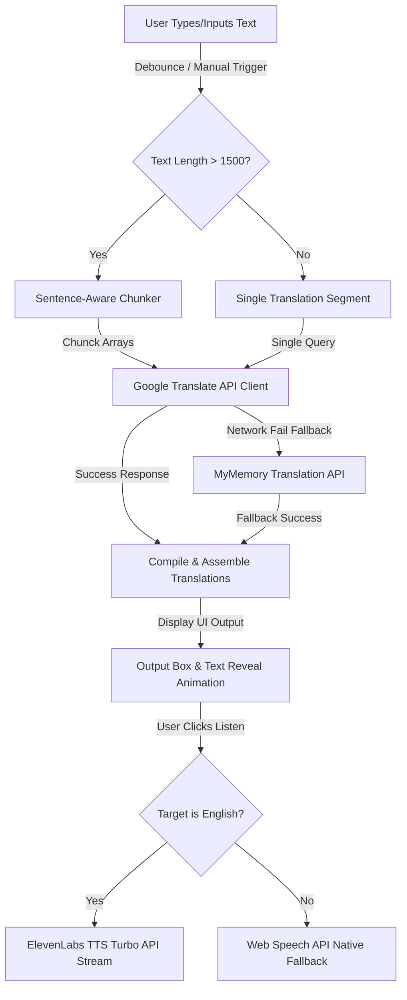

<div align="center">

# 🌍 LanguX — AI Language Translator
**Translate anything, instantly.**


[](https://langux.vercel.app/)

</div>

---

## 📖 About

**LanguX** is a high-performance web-based AI translation engine built with a minimalist glassmorphism interface in a warm Soft Cream (`#F3EADB`) and solid Black (`#111111`) layout. It translates text blocks up to 50,000 characters across 100+ global languages. 

Equipped with sentence-aware text chunking and streaming ElevenLabs API integration, LanguX translates your input and reads English translations back to you in a studio-quality AI voice.

---

## ✨ Features

- ✅ **Multi-Language Support**: Instantly translate text between over 100 global languages.
- ✅ **Instant Translation**: Trigger automatic debounced translations as you type, or use manual translation controls.
- ✅ **50,000 Character Limit**: Process large documents easily without experiencing browser lag or performance drops.
- ✅ **Clean UI**: Interact with a single-viewport, glassmorphism layout optimized for both laptop and mobile screens.
- ✅ **Smart Sentence Chunking**: Split input text at sentence boundaries into 1500-character units to prevent API request drops.
- ✅ **Custom Speech Synthesis (TTS)**: Stream premium English audio playback using the ElevenLabs API, or fallback to native device TTS.
- ✅ **Keyboard Shortcuts**: Execute quick translations using `Cmd/Ctrl + Enter` and copy output using `Cmd/Ctrl + Shift + C`.
- ✅ **Searchable Custom Dropdowns**: Discover and filter target languages quickly using searchable select menus.
- ✅ **Copy-to-Clipboard & Toasts**: Copy your translation output with one click and see animated toast notifications.

---

## ⚙️ How It Works



1. **Translation API Pipeline**: Splits text input exceeding 1,500 characters at sentence boundaries into smaller chunks to bypass API payload size constraints.
2. **Request & Response Flow**: Dispatches text chunks asynchronously to the Google Translate API, falling back to the MyMemory API if a network error occurs.
3. **Response Assembly**: Combines the translated segments and updates the UI with an elegant text reveal transition effect.
4. **TTS Audio Streaming**: Streams English speech synthesis via ElevenLabs' low-latency `eleven_turbo_v2_5` model at a natural `1.2x` pace, caching the audio locally.

---

## 🌐 Supported Languages (100+)

LanguX supports translation across all of the following languages:

Afrikaans, Albanian, Amharic, Arabic, Armenian, Azerbaijani, Basque, Belarusian, Bengali, Bosnian, Bulgarian, Catalan, Cebuano, Chinese (Simplified), Chinese (Traditional), Corsican, Croatian, Czech, Danish, Dutch, English, Esperanto, Estonian, Finnish, French, Frisian, Galician, Georgian, German, Greek, Gujarati, Haitian Creole, Hausa, Hawaiian, Hebrew, Hindi, Hmong, Hungarian, Icelandic, Igbo, Indonesian, Irish, Italian, Japanese, Javanese, Kannada, Kazakh, Khmer, Kinyarwanda, Korean, Kurdish, Kyrgyz, Lao, Latin, Latvian, Lithuanian, Luxembourgish, Macedonian, Malagasy, Malay, Malayalam, Maltese, Maori, Marathi, Mongolian, Myanmar (Burmese), Nepali, Norwegian, Nyanja (Chichewa), Odia (Oriya), Pashto, Persian, Polish, Portuguese, Punjabi, Romanian, Russian, Samoan, Scots Gaelic, Serbian, Sesotho, Shona, Sindhi, Sinhala, Slovak, Slovenian, Somali, Spanish, Sundanese, Swahili, Swedish, Tagalog (Filipino), Tajik, Tamil, Tatar, Telugu, Thai, Turkish, Turkmen, Ukrainian, Urdu, Uyghur, Uzbek, Vietnamese, Welsh, Xhosa, Yiddish, Yoruba, Zulu.

---

## 🛠 Tech Stack

- **Frontend Core:** HTML5, CSS3 (CSS Grid, Variables, Keyframe Animations), Vanilla JavaScript (ES6)
- **APIs:** Google Translate API, MyMemory Translation API, ElevenLabs TTS API
- **Local Utilities:** LocalStorage (user preference persistence), Clipboard API (async navigator copy), Web Speech Synthesis API

---

## 🚀 How to Run

1. **Clone the repository:**
   ```bash
   git clone https://github.com/poovarasu638178-rgb/codealpha_tasks.git
   ```
2. **Navigate to the task directory:**
   ```bash
   cd codealpha_tasks/Task3_LangUX
   ```
3. **Start a local HTTP server:**
   ```bash
   python3 -m http.server 8080
   ```
4. **Open in Browser:**
   Go to `http://localhost:8080` to start translating!

---

## 📂 Project Structure

```text
LanguX/
│
├── index.html        # Structure and core interface elements
├── style.css         # UI variables, layout grid, fonts, and styling
├── script.js         # Text chunking, translation APIs, custom select, and TTS logic
├── server.js         # Node.js server for local static hosting
├── vercel.json       # Deployment configuration file
├── favicon.png       # Application icon
└── README.md         # Documentation
```

---

## 👨‍💻 Author

Built by **Poovarasu S**
- **GitHub:** [@poovarasu638178-rgb](https://github.com/poovarasu638178-rgb)
- **Internship:** CodeAlpha AI Internship 2026
- **Student ID:** CA/DF1/126353

---

## 📄 License

This project is licensed under the **MIT License**.

---

<div align="center">
  <b>⭐ Star this repo if you found it helpful!</b>
</div>
