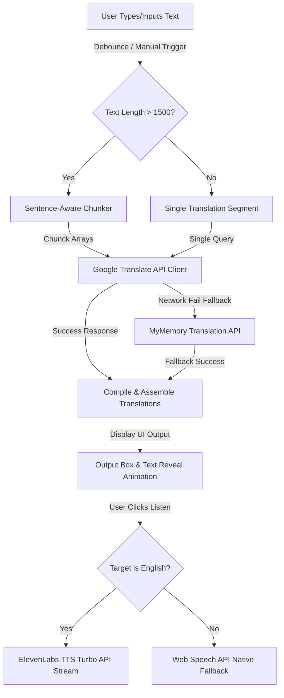

<div align="center">

# 🌍 LanguX — AI Language Translator
**Translate anything, instantly.**


[](https://langux.vercel.app/)

</div>

---

## 📖 About

**LanguX** is a premium, high-performance web-based AI translation engine designed with a minimalist glassmorphism interface in a warm Soft Cream (`#F3EADB`) and solid Black (`#111111`) layout. LanguX allows users to translate massive blocks of text up to 50,000 characters flawlessly across 100+ global languages. 

Equipped with intelligent sentence-aware text chunking and ultra-fast streaming ElevenLabs API integration, LanguX doesn't just translate text—it speaks English translations back to you in a studio-quality AI voice, with a native device fallback for other global languages.

---

## ✨ Features

✅ **Multi-Language Support:** Flawlessly translate between over 100 global languages.
✅ **Instant Translation:** Automatic debounced translation triggers as you type, alongside standard manual translation.
✅ **50,000 Character Limit:** Paste huge text documents without performance degradation.
✅ **Clean UI:** Single-viewport, compact grid layout with card glassmorphism and micro-animations, optimized to fit laptop and mobile screen resolutions without vertical scrolling.
✅ **Smart Sentence Chunking:** Automatically segments text at sentence boundaries into ~1500 character units to avoid translation API packet drops and constraints.
✅ **Custom Speech Synthesis (TTS):** Premium ElevenLabs API streaming integration for English audio playback, with automatic browser-native fallback for global languages.
✅ **Keyboard Shortcuts:** Fast translation (`Cmd/Ctrl + Enter`) and copy (`Cmd/Ctrl + Shift + C`) command bindings.
✅ **Searchable Custom Dropdowns:** Elegant searchable selector dropdowns for swift language discovery.
✅ **Copy-to-Clipboard & Toasts:** Instant copies with premium animated status notifications.

---

## ⚙️ How It Works



1. **Translation API Pipeline:** On input, text is fed into a chunking pipeline. If the text size exceeds 1,500 characters, it is parsed at boundary punctuation marks into discrete chunks to prevent API constraints.
2. **Language Request/Response Flow:** Each chunk is dispatched asynchronously to the Google Translate API endpoint. In the event of a network drop, it automatically falls back to the MyMemory API.
3. **Response Assembly:** The resolved translated text chunks are merged and pushed to the UI with a reveal transition effect.
4. **TTS Audio Streaming:** English translation audios are requested from the ElevenLabs TTS API using the low-latency `eleven_turbo_v2_5` model, accelerated to a natural `1.2x` speaking pace, and cached locally.

---

## 🌐 Supported Languages (100+)

LanguX supports all of the following languages:

Afrikaans, Albanian, Amharic, Arabic, Armenian, Azerbaijani, Basque, Belarusian, Bengali, Bosnian, Bulgarian, Catalan, Cebuano, Chinese (Simplified), Chinese (Traditional), Corsican, Croatian, Czech, Danish, Dutch, English, Esperanto, Estonian, Finnish, French, Frisian, Galician, Georgian, German, Greek, Gujarati, Haitian Creole, Hausa, Hawaiian, Hebrew, Hindi, Hmong, Hungarian, Icelandic, Igbo, Indonesian, Irish, Italian, Japanese, Javanese, Kannada, Kazakh, Khmer, Kinyarwanda, Korean, Kurdish, Kyrgyz, Lao, Latin, Latvian, Lithuanian, Luxembourgish, Macedonian, Malagasy, Malay, Malayalam, Maltese, Maori, Marathi, Mongolian, Myanmar (Burmese), Nepali, Norwegian, Nyanja (Chichewa), Odia (Oriya), Pashto, Persian, Polish, Portuguese, Punjabi, Romanian, Russian, Samoan, Scots Gaelic, Serbian, Sesotho, Shona, Sindhi, Sinhala, Slovak, Slovenian, Somali, Spanish, Sundanese, Swahili, Swedish, Tagalog (Filipino), Tajik, Tamil, Tatar, Telugu, Thai, Turkish, Turkmen, Ukrainian, Urdu, Uyghur, Uzbek, Vietnamese, Welsh, Xhosa, Yiddish, Yoruba, Zulu.

---

## 🛠 Tech Stack

- **Frontend Core:** HTML5, CSS3 (CSS Grid, Variables, Keyframe Animations), Vanilla JavaScript (ES6)
- **APIs:** Google Translate API, MyMemory Translation API, ElevenLabs TTS API
- **Local Utilities:** LocalStorage (user preference persistence), Clipboard API (async navigator copy), Web Speech Synthesis API

---

## 🚀 How to Run

1. **Clone the repository:**
   ```bash
   git clone https://github.com/poovarasu638178-rgb/codealpha_tasks.git
   ```
2. **Navigate to the task directory:**
   ```bash
   cd codealpha_tasks/Task3_LangUX
   ```
3. **Start a local HTTP server:**
   ```bash
   python3 -m http.server 8080
   ```
4. **Open in Browser:**
   Go to `http://localhost:8080` to start translating!

---

## 📂 Project Structure

```text
LanguX/
│
├── index.html        # Structure and core interface elements
├── style.css         # UI variables, layout grid, fonts, and styling
├── script.js         # Text chunking, translation APIs, custom select, and TTS logic
├── server.js         # Node.js server for local static hosting
├── vercel.json       # Deployment configuration file
├── favicon.png       # Application icon
└── README.md         # Documentation
```

---

## 👨‍💻 Author

Built by **Poovarasu S**
- **GitHub:** [@poovarasu638178-rgb](https://github.com/poovarasu638178-rgb)
- **Internship:** CodeAlpha AI Internship 2026
- **Student ID:** CA/DF1/126353

---

## 📄 License

This project is licensed under the **MIT License**.

---

<div align="center">
  <b>⭐ Star this repo if you found it helpful!</b>
</div>
